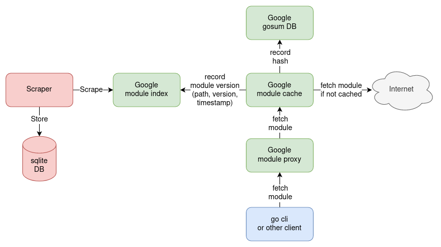

# Go module proxy index scraper

Scrapes all golang module versions indexed in the Google module proxy and
stores the results in a sqlite database.
The resulting database has a size of ~2 GB as of 01.01.2022.

The scraper can be stopped and started safely.
It will continue scraping where it was stopped.



## Implementation

index.golang.org is an index which serves a feed of new module versions that become
available by proxy.golang.org.
The list is sorted in chronological order. There are two optional parameters:
- 'since': the oldest allowable timestamp (RFC3339 format) for module versions in the returned list. Default is the
  beginning of time, e.g. https://index.golang.org/index?since=2019-04-10T19:08:52.997264Z
- 'limit': the maximum length of the returned list. Default = 2000, Max = 2000,
  e.g. https://index.golang.org/index?limit=10

Program logic:
1. Create database and tables if they don't exist.
2. Determine `since` value from most recent entry in sqlite DB or default to beginning of time.
3. Start goroutine that scrapes index continuously until the feed is fully consumed.
   Results are written to a channel. Result channel is closed once feed is fully consumed.
4. Start goroutine that stores the results into a sqlite DB continuously.
5. Exit program once scraping finished and all results were stored.

## Motivation

My motivation was to study and explore the golang ecosystem.
For example, one can find out which domains provide the most modules:
```sql
select
    coalesce(nullif(substr(path, 0, instr(path, '/')), ''), path) as domain,
    count(distinct path) as modules
from moduleVersion
group by domain
order by modules desc
limit 50;
```
| domain | modules |
| :--- | :--- |
| github.com | 601085 |
| gitlab.com | 8381 |
| gopher.live | 7820 |
| gitee.com | 5367 |
| gopkg.in | 5264 |
| bitbucket.org | 2867 |
| git.sr.ht | 804 |
| go-micro.dev | 704 |
| k8s.io | 470 |
| sigs.k8s.io | 318 |
| go.buf.build | 310 |
| gitea.com | 256 |
| code.cloudfoundry.org | 201 |
| gitlab.dms3.io | 161 |
| go.opentelemetry.io | 154 |
| e.coding.net | 150 |
| codeberg.org | 148 |
| play-with-go.dev | 117 |
| knative.dev | 117 |
| pkg.re | 114 |
| cloud.google.com | 112 |
| code.aliyun.com | 110 |
| code.gitea.io | 99 |
| dev.azure.com | 92 |
| modernc.org | 91 |
| gitlab.softpark.kz | 87 |
| moul.io | 85 |
| 54hub.com | 79 |
| rsc.io | 71 |
| forge.chapril.org | 67 |
| launchpad.net | 65 |
| xn--rhta.xyz | 64 |
| decred.org | 64 |
| golang.org | 63 |
| git.gendocu.com | 60 |
| git.xuekaole.com | 56 |
| gomodules.xyz | 55 |
| xgit.xiaoniangao.cn | 54 |
| vimagination.zapto.org | 53 |
| thebigman.ddns.net | 53 |
| zgo.at | 52 |
| kubevirt.io | 49 |
| fknsrs.biz | 49 |
| www.github.com | 47 |
| pault.ag | 46 |
| hawx.me | 46 |
| go.elastic.co | 46 |
| go.spiff.io | 44 |
| git.darknebu.la | 44 |
| gist.github.com | 44 |

The next step could be fetching all go.mod files and analyzing the module dependencies.

## References

- [https://go.dev/ref/mod](https://go.dev/ref/mod)
- [https://index.golang.org/](https://index.golang.org/)
